# Outliner

For many years I managed projects and products using an outlining application
on my iPad. The problem with this was that the iPad app couldn't print
and I needed to print. So I wrote myself a compatible application for
Windows in C#. That worked out well and I gained the ability to both
edit my outlines and produce reports for anyone that needed hardcopy (or
just wanted a PDF).

Over time, I have upgraded to using My Life Organized, which is available
of the PC and the iPad. Overall I have been happy with this, but it's over-kill
for my needs and has some unfortunate restrictions with synchronising data
between devices. It also does not have a Mac version, so I am forced to 
use the iPad version on the Mac and, yet again, forego printing.

As a result, I have embarked on a bit of a journey to create an outlining
application for the Mac. There seem to be very few of them around so, if I
want the functionality I need, I need to write it myself. 

This is, by far, the largest and most complex application I have written for the
Mac. The first version is functionally complete (no printing!) but, as yet,
not extensively tested. As best I can tell, it's working and remains 
compatible with my old Windows program. That was a major design goal.

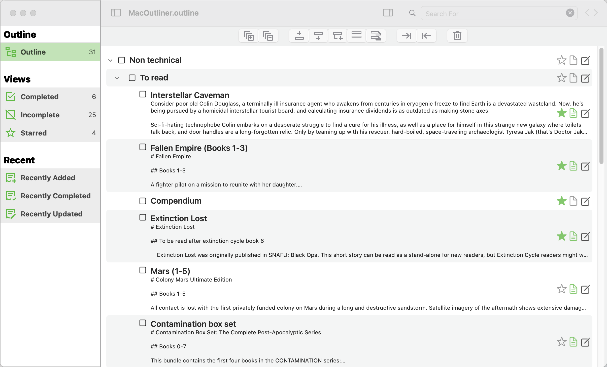

## What did I want to achieve

At the most basic level, I felt the need to write something that couldn't be
classified as <em>trivial</em>. I have written several complete apps, but
nothing large or complex or, for that matter, for the Mac. Writing for the
Mac was going to be a challenge. It is similar to writing for iOS, but
different in so many ways.

So, my aims for this application:

* A substantial Mac application.
* Something that can open and update OPML files from the PC.
* A multi-window application, so I can have more than one file open at the same time.
* Recent File management, including retaining the location and size of the window.
* Implementing a tree structure in SwiftUI - no simple task!
* The use of Markdown with conversion to HTML for preview.
* Copy and paste of the data in the tree structure.
* Copy and paste structured data between windows, allowing me to copy whole structures between files.
* Handling XML data.

As usual with my apps, my intention was to avoid using third party packages
wherever possible.

This is what I have achieved so far. There is a lot of functionality
wrapped up in the code, so I'll address components of the 
application below.

### Application Start

One of the things that irritate me in applications is the startup. Some just
start up empty so you are forced to open an existing file or create a new 
one. Worse, some applications automatically re-open the last opened file. Granted,
that can be helpful, but becomes less so when you're managing multiple 
outlines. So, rather than force my decisions on the user, I present an
opening screen and let them decide what to do:

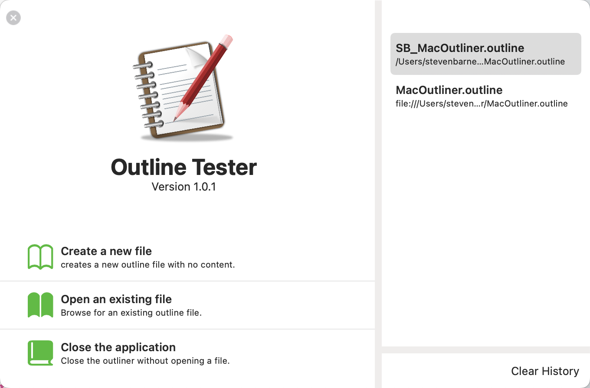

On the left, there are buttons to allow the user to create a new file, open an
existing file or quit the application. On the right, I present a list of
the most recently opened outlines. The user can double click one of these to
open it. It's a simple, but effective, opening window. 

Once the application has started, you can access the list of recent files
from the <em>Open Recent</em> menu item of the <em>File</em> menu.

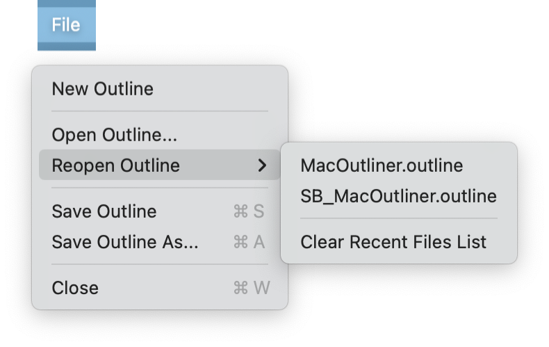

### The Main Window
When a file is opened, the contents are loaded and the main window opens:

On the left are the filters that we can use to control how the outline
is displayed. By default, the outline is shown. However, you can limit
the display to 

* Completed items
* Incomplete items
* Starred items
* Recently added items
* Recently completed items
* Recently updated items

These are presented as lists rather than outlines as they are easier to manage 
in list form.

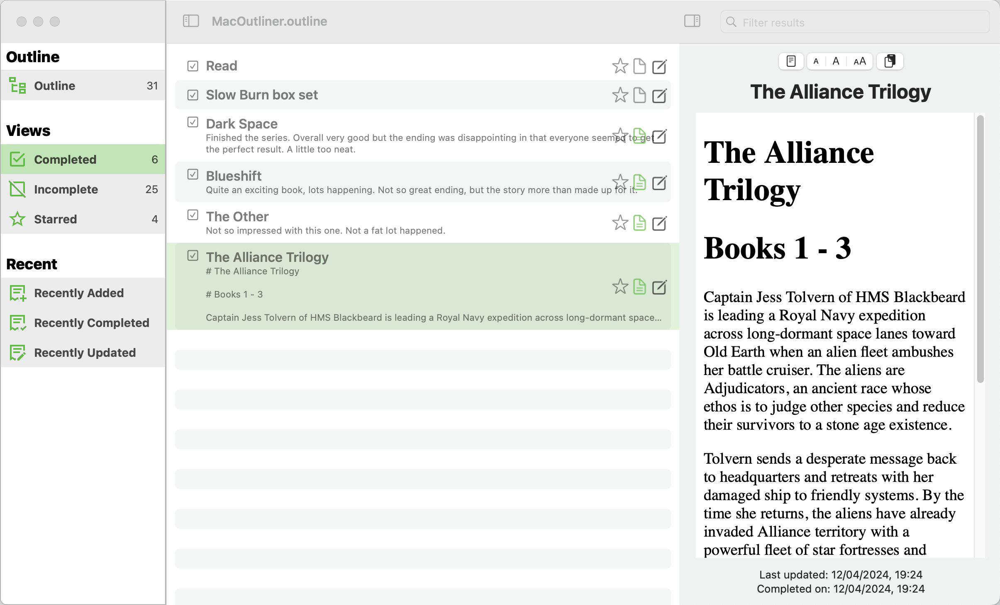

On the right is the outline, showing the file structure. For each item, you
can see the title and a few lines of the description. How many lines is 
determined by a system option.

Above the outline is a tool bar allowing you to:

* Expand the hierarchy
* Collapse the hierarchy
* Insert an item above the currently selected item, at the same level
* Insert an item below the currently selected item, at the same level
* Insert an item as a child of the current item
* Duplicate the current item
* Duplicate the current item and all of it's children
* Move an item to a lower level
* Promote an item to it's parent level
* Delete an item

There are menu items to duplicate this functionality.

Overlaying each item in the outline are three icons for the most used 
functionality. Using these icons you can toggle the starred state,
popup a window with the formatted note or popup the item editor.

### Main Window With Preview
While the structure is vitally important, the notes are where the detail
lies, so there is an option to display a preview of the notes to the right:

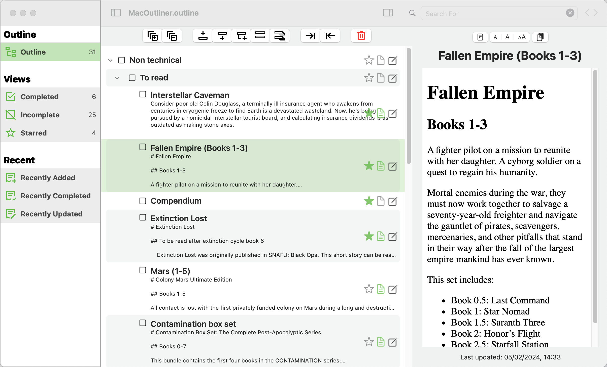

Notes are plain text, but can be formatted in Markdown.

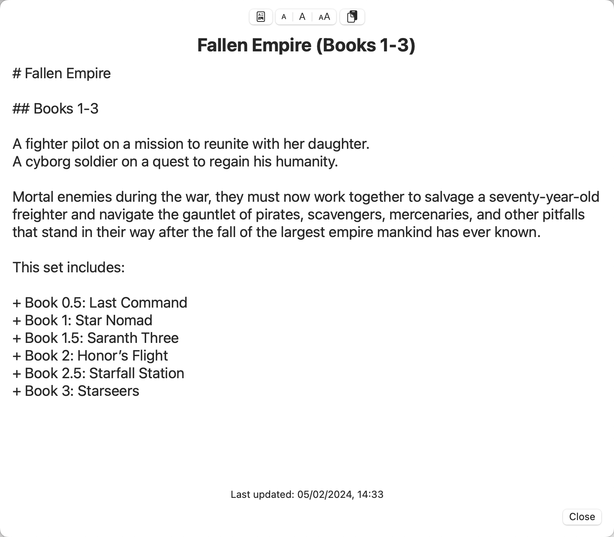

Since markdown
is straight forward to write but less obvious to display, the preview pane
shows the text formatted as an HTML web page. You can display the plain text
if you want to, but the HTML typically looks better.

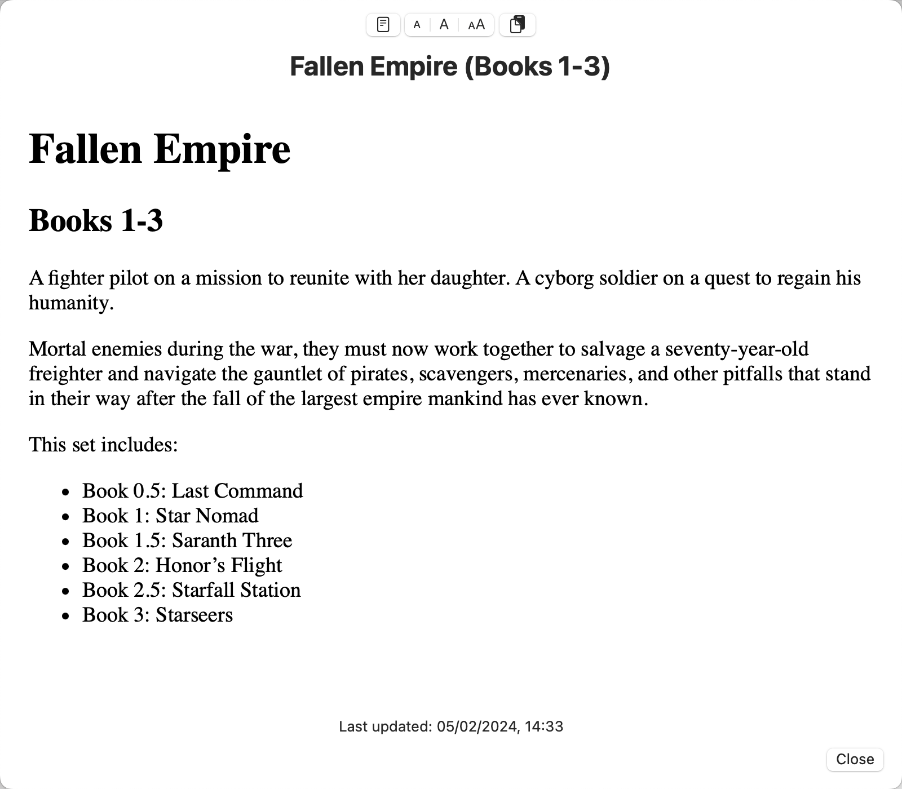

There is a splitter between the outline and the preview, so you can adjust the
relative window sizes to suit your needs.

There are icons over the preview allowing you to switch between plain text
and HTML view, to adjust the text size and to copy the text to the pasteboard.

### Item Editor

Individual items have been kept as simple as possible in order to keep the
application simple. Essentially, an item consists of a title and a
description (in Markdown format). The only other attributes of an item
is it's starred state - a toggle switch which we can use in filters - and
it's completion date.

Given the simple data, editing of an item is achieved using a simple editor window.

To aid with formatting notes, the note editor has a preview tab that can be
selected to show the HTML formatted note.

### Finding Items

Having all this data is pointless if you cannot find the information you put
in to it. To help with this, the title bar includes a filter box that you
use to filter the outline or the lists.

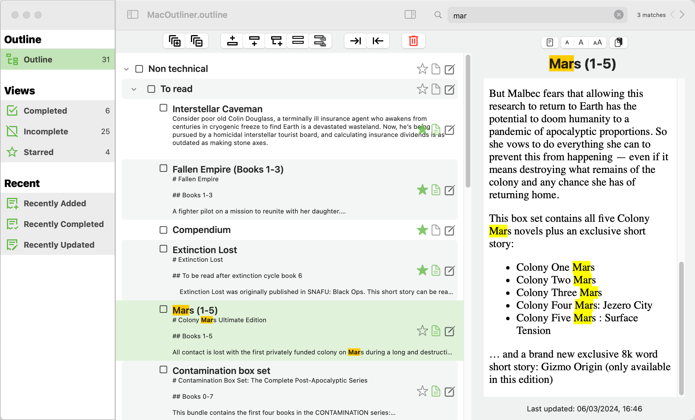

As you type characters into the filter box, the outline is scanned for items that
contain matching text. You control what is searched via the system settings. Items
that match are highlighted and the preview, if open, is also highlighted. To the
right of the search bar are buttons to scroll to the next or previous item.

If one of the list views is open, the list will be filtered to show only 
matching items.

### Customising The Application

There are a small number of settings associated with the application. These are
accessed via the <em>Settings</em> menu option.

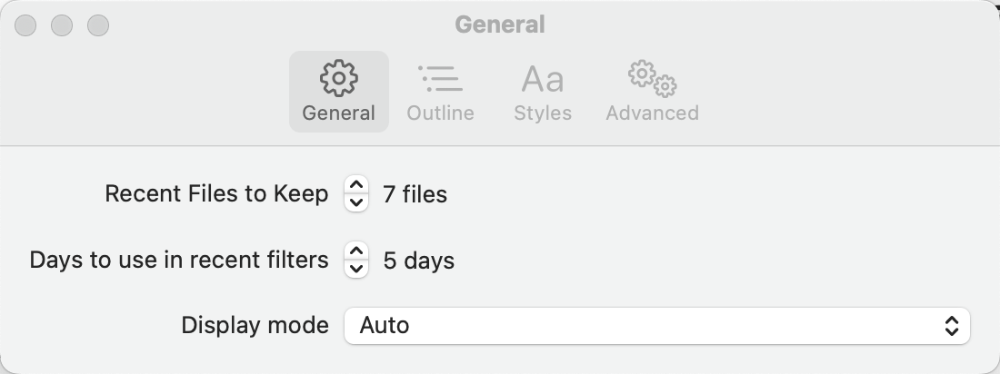

General settings allow you to determine how many files that appear in the recent
files list on the opening screen and the reopen menu. The Days for Recent Items value
controls how many days we want to use to determine how old an item is when applying
one of the 'recent' filters. Finally, Display Mode determines whether the 
application works in light mode, dark mode or follows the current system state.

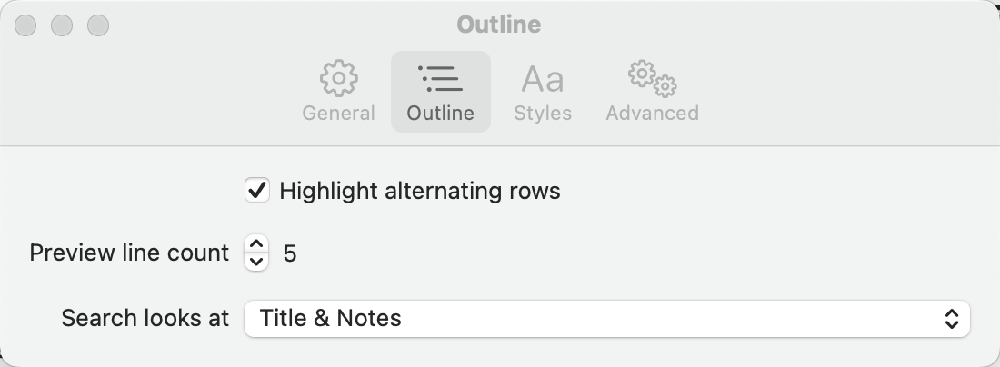

Outline settings affects how items are displayed and what is searched when a
filter is applied. When Highlight Alternate Rows is checked, the background of
each row is shaded to help provide clear differentiation between rows. From here 
you can also adjust the number of rows of preview text that are displayed
in the items.

The final option determines what text is searched when you enter filter text
in the filter box at the top of the window. You can choose between searching
the title, the note or both.

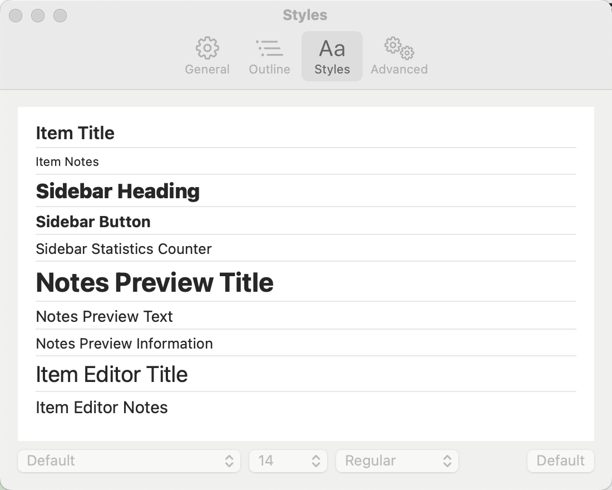

The styles settings give you an opportunity to edit the font characteristics
for all aspects of the application. While most of the time the default settings
will be fine, it makes life easier if you can customise text sizes.

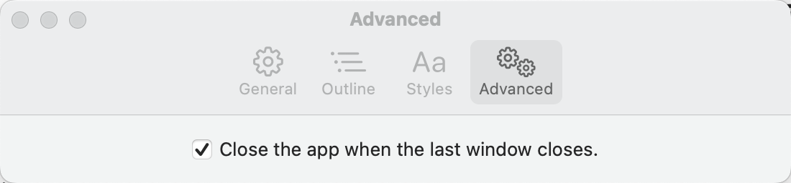

There is only one advanced setting. Mac applications typically have two options that 
control what happens when you close the last open window. They either remain open
to get you open a different file or they close with the last file. My preference
is that the application closes with the last file, but I recognise that this is
not necessarily the best option for everyone, so you can toggle this
functionality in the advanced settings.

### About The Application

No Mac application would be complete without an About Box. The free out-of-the-box 
window is fine, but I wanted better.

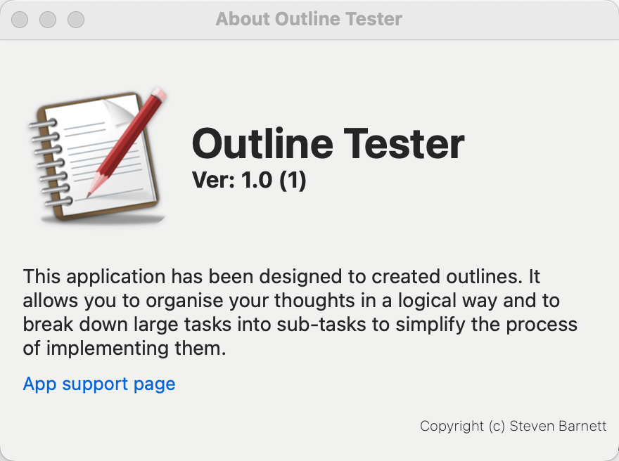

## What next?

The application is a firm basis for future development. It has all of the basic components
in place and has all of the base functionality you need for this kind of application. However, it
Has not been properly tested yet, so will contain bugs, and will need code tidy up and 
additional functionality. 

In an ideal world, I would want to ditch the XML for JSON. It might be nice to extend into a file format
that would let me save images. I also need to add the printing and reporting functionality I originally
wrote the Windows version for!

When I get this sorted out, I will need to loo into creating an iOS version for the iPad. When I do that, I
Need to sort out how to share data using iCloud or OneDrive.

The list is endless.